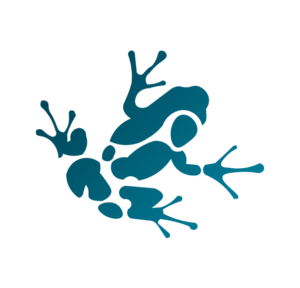
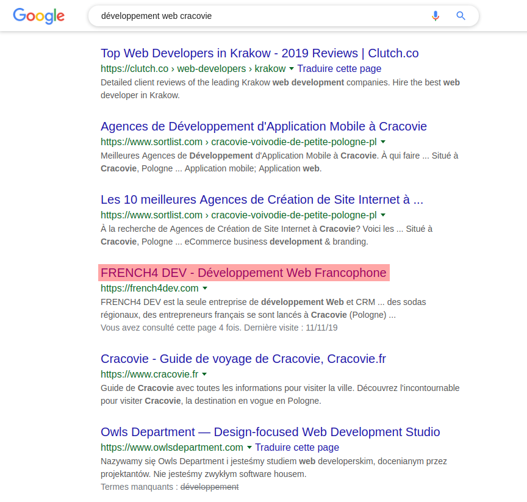
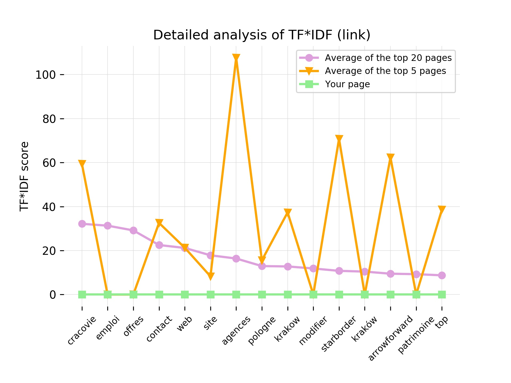

# Optimisateur SEO

### Documentation :clipboard:

##### FRENCH4 DEV (commencé le 14 octobre 2019)

---

<div style="text-align:center;">
  
</div>

---

## Table des matières
1.  [Objectif du projet](#objectif-du-projet-pushpin)
2.  [Exemple détaillé](#exemple-détaillé-chart_with_downwards_trend)
3.  [Informations complémentaires](#informations-complémentaires-speech_balloon)
4.  [ToDo](#todo-pencil)

---

## Objectif du projet :pushpin:

Le projet a pour but d'**améliorer le référencement d'une page web** (et non d'un site) donnée au sein des résultats renvoyés par le moteur de recherche Google **pour une requête précise**.

Ainsi, l'outil développé prend en compte plusieurs paramètres, dont les deux suivants :
-   l'**adresse URL** de la page dont l'utilisateur souhaiterait améliorer le SEO
-   la **requête** (suite de mots-clés) pour laquelle il souhaiterait que la page soit mieux positionnée

L'idée principale de l'outil tourne autour de la **recherche des termes qui permettent à une page de monter dans le classement des résultats** pour pouvoir ensuite utiliser ces termes à l'avantage de l'utilisateur.

---

## Exemple détaillé :chart_with_downwards_trend:

Imaginons que l'on souhaite que la page web de **[FRENCH4 DEV](https://www.french4dev.com/)** soit positionnée plus haut dans les résultats de la recherche **```développement web cracovie```**.

Pour l'instant, la page se situe à la 4ème position, mais on aimerait atteindre le top 3 car ces sites attirent plus de 50% des utilisateurs.



**L'outil va alors nous permettre de déterminer quels sont les termes qui, une fois insérés dans le code de notre page, vont améliorer sa position dans les résultats de la requête choisie.**

De plus, ces termes sont recherchés dans des **balises spécifiques** qui sont connues pour avoir un impact important sur le SEO. On peut par exemple citer :

-   la balise _**title**_ (titre), qui détermine de quelle manière est nommée la page notamment dans la page de résultats de Google ; pour la notre, on a par exemple :

    ```HTML
    <title>FRENCH4 DEV - Développement Web Francophone</title>
    ```

-   la balise méta _**description**_, dont le contenu se retrouve notamment sous le titre associé à une page dans les résultats de recherche ; pour notre page, on a par exemple :

    ```HTML
    <meta name="description" content="FRENCH4 DEV est la seule entreprise de développement Web et CRM francophone d'Europe de l'Est. Nous adressons exclusivement le marché français pour faire bénéficier à nos clients une expertise IT de dernière génération, en français et à un coup optimisé."/>
    ```

-   ...

**L'importance d'une balise vis-à-vis du SEO varie au cours du temps, mais l'outil est capable de s'adapter à ce genre d'évolution.** Si une balise devient obsolète demain, alors elle sera ignorée ; si une nouvelle émerge, alors elle sera étudiée et des modifications seront recommandées à l'utilisateur.

Pour pouvoir identifier les termes présents dans ces balises et qui ont un impact sur le référencement, **l'outil se base sur une méthode de calcul** appelée **[TF-IDF](https://fr.wikipedia.org/wiki/TF-IDF)** (_term frequency - inverse document frequency_), populaire dans le monde de la recherche d'information.

Voici une représentation graphique du résultat que l'on obtient pour notre exemple et appliqué à la balise _link_ (ou _anchor_, qui contient les liens qui dirigent l'utilisateurs vers d'autres pages au cours de sa navigation) :



Plus le score d'un terme est élevé, plus il est jugé comme étant important vis-à-vis du référencement. Cet ordre est défini par le score moyen calculé sur une base d'un nombre donné de sites. Ici, on a analysé les 20 premiers (courbe violette).

**Ainsi, le terme ```Cracovie```, une fois inséré dans une des balises _link_ de notre page, devrait permettre de rendre cette dernière plus pertinente par rapport à la requête ```développement web cracovie```, et donc d'améliorer son positionnement.** C'est en effet celui qui a le meilleur score, mais les autres termes sont aussi bons à prendre.

Cette représentation permet aussi, grâce à la courbe verte, d'évaluer comment se porte notre page vis-à-vis de ces termes. On voit par exemple ici que notre site n'en comporte aucun pour la balise étudiée (scores à 0), et **l'idée est donc de faire en sorte que la courbe verte rejoigne la courbe violette**. On peut aussi chercher à rejoindre la courbe orange qui représente l'analyse des scores pour les meilleurs termes sur les 5 (et non 20) premières pages. **D'une manière générale, se positionner entre la courbe violette et la courbe orange devrait résulter en une amélioration du référencement de la page.**

**Mais comment faire pour augmenter le score d'un terme au sein d'une balise ?** D'après la formule de **TF-IDF**, soit on augmente sa fréquence d'apparition, soit on diminue le nombre total de termes dans la balise donnée.

Si l'on a :

```HTML
<a href="equipe.html">Notre équipe de développeurs est toujours à votre écoute et prête à vous rendre service</a>
```

Alors on peut améliorer le positionnement de notre page en écrivant plutôt :

```HTML
<a href="equipe.html">Notre équipe à Cracovie</a>
```

**Procéder à ce genre de modification pour chacune des balises jugées comme étant essentielles à un bon référencement permet d'augmenter considérablement les chances d'apparaître parmis les meilleurs résultats de la recherche.**

---

## Informations complémentaires :speech_balloon:

L'outil intègre les résultats de **[Google Trends](https://trends.google.fr/trends/)** pour les mots-clés de la requête pour laquelle l'utilisateur souhaite que sa page apparaisse. Ainsi, pour notre requête **```développement web cracovie```**, on pourra savoir que ```web application```, ```web development``` et ```web solutions``` sont d'autres requêtes associées au terme ```web``` qui sont populaires en ce moment et pour lesquelles il est donc potentiellement intéressant de chercher à se positionner.

---

## ToDo :pencil:

-   écrit le **12/11/2019**
    -   créer une interface client pour pouvoir utiliser l'outil facilement et visualiser les résultats rapidement, avec notamment la possibilité de :
        -   modifier l'URL de la page à optimiser
        -   modifier la requête pour laquelle on souhaite mieux se positionner
        -   modifier le nombre de pages à analyser (_average_ et _top_) via des curseurs
    -   modifier le nombre de mots-clés à afficher
    -   ajouter un champ (dans le fichier JSON des résultats) correspondant à l'analyse TF-IDF de tous les termes, sans restriction à une balise spécifique
